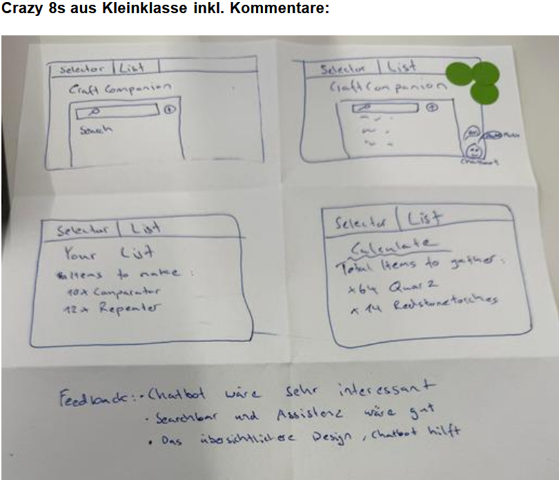
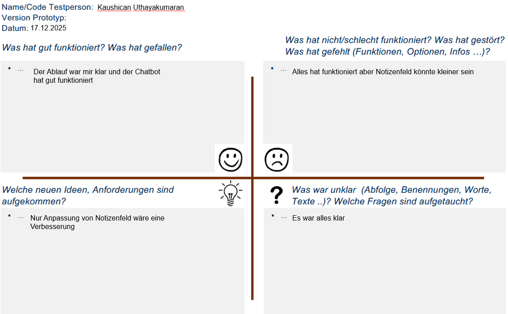
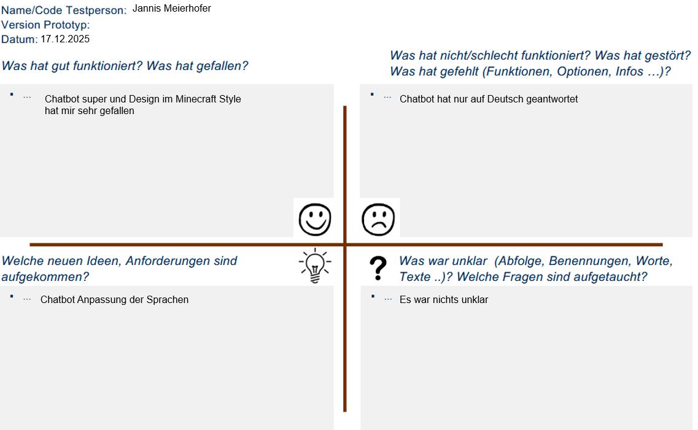
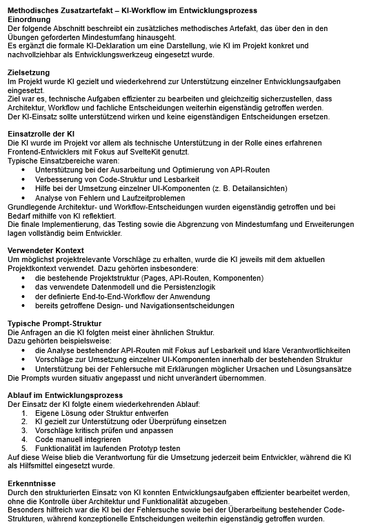
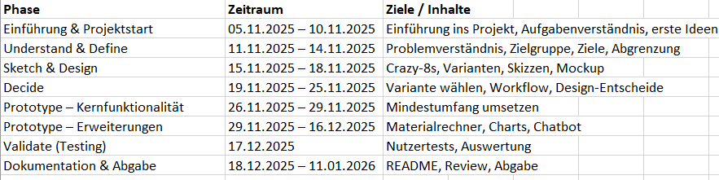

# Projektdokumentation – [Craft Companion]

## Inhaltsverzeichnis

1. [Einordnung & Zielsetzung](#1-einordnung--zielsetzung)
2. [Zielgruppe & Stakeholder](#2-zielgruppe--stakeholder)
3. [Anforderungen & Umfang](#3-anforderungen--umfang)
4. [Vorgehen & Artefakte](#4-vorgehen--artefakte)
    - [Understand & Define](#41-understand--define)
    - [Sketch](#42-sketch)
    - [Decide](#43-decide)
    - [Prototype](#44-prototype)
    - [Validate](#45-validate)
5. [Erweiterungen [Optional]](#5-erweiterungen-optional)
6. [Projektorganisation [Optional]](#6-projektorganisation-optional)
7. [KI‑Deklaration](#7-ki‑deklaration)
8. [Anhang [Optional]](#8-anhang-optional)

<!-- WICHTIG: DIE KAPITELSTRUKTUR DARF NICHT VERÄNDERT WERDEN! -->

<!-- Diese Vorlage ist für eine README.md im Repository gedacht. Abschnitte mit [Optional] können weggelassen werden, wenn in den Übungen nichts anderes verlangt wird. -->

## 1. Einordnung & Zielsetzung
Kurz beschreiben, welches Problem adressiert wird und welches Ergebnis angestrebt ist.
- **Kontext & Problem:**
Im Computerspiel Minecraft bauen viele Spielende grosse automatische Farmen und komplexe Redstone-Systeme. Dabei wird es schnell unübersichtlich, welche Grundressourcen und Crafting-Schritte benötigt werden. Die Planung erfolgt oft mit mehreren externen Quellen, was den Prozess erschwert. 

- **Ziele:** 
Craft Companion stellt eine zentrale Übersicht über benötigte Materialien für grosse Farm- und Redstone-Projekte bereit. Des weiteren werden Crafting-Rezepte und Kategorien direkt angezeigt und es können persönliche Itemlisten erstellt, gespeichert und verwaltet werden. Da viele Minecraft-Tools und Java basierte Plugins verwendet werden, ist ein JSON Export der Grundmaterialienliste möglich.

- **Abgrenzung [Optional]:** 
Die Anwendung verbindet sich nicht mit Minecraft-Welten und ersetzt keine Mods; sie dient ausschliesslich der Planung ausserhalb des Spiels.

## 2. Zielgruppe & Stakeholder
Wem nützt die Lösung, wer ist beteiligt oder betroffen?
- **Primäre Zielgruppe:**
Minecraft-Spielende, die grosse Farmen oder Redstone-Konstruktionen planen und dafür eine strukturierte Übersicht benötigen.

- **Annahmen [Optional]:** 
Nutzende kennen grundlegende Minecraft-Mechaniken und Crafting-Systeme.

## 3. Anforderungen & Umfang

- **Kernfunktionalität (Mindestumfang):** 

- Items suchen und aus einer Datenbank auswählen.

- Items persistent in MongoDB speichern.

- Übersichtsseite („My List“) mit allen gespeicherten Items.

- Detailansicht mit Crafting-Rezept und Kategorie (Component).

- Notizen erfassen, bearbeiten und löschen.

- Verständliche Navigation und durchgängiger Workflow.

- **Akzeptanzkriterien:** 

- Ein Item kann vollständig von der Suche bis zur Detailansicht verwendet werden

- Gespeicherte Daten bleiben nach Reload bestehen.

- Notizen funktionieren ohne Fehlermeldungen und können verwwaltet werden.

- Nutzer können selbständig Items hinzufügen oder löschen
- **Erweiterungen [Optional]:** 

- Chatbot für Minecraft-Fragen

- Dynamische Suchleiste

- Kategorienanalyse mit Chart.js

- Automatische Grundmaterialberechnung in Collect (Craftingrezept pro Item * Anzahl der Gewählten Items)

- JSON-Download der berechneten Grundmaterialien

- Hintergrundbilder im Minecraft-Stil

- Minecraft Schriftart

## 4. Vorgehen & Artefakte

### 4.1 Understand & Define
- **Ausgangslage & Ziele:**
Spielende brauchen eine zentrale, einfache Übersicht für komplexe Bauprojekte. Die Webanwendung soll diese Informationen bündeln und planbarer machen.
- **Zielgruppenverständnis:** 
Nutzer möchten Rezepte, Kategorien und Materialmengen schnell auslesen können.
- **Wesentliche Erkenntnisse:**
- Nutzende möchten Materialmengen möglichst früh abschätzen, um unnötige Farmen oder Fehlplanungen zu vermeiden.
- Der Wechsel zwischen mehreren externen Quellen (Wiki, Rechner, Notizen) wird als störend empfunden.
- Eine visuelle, kompakte Darstellung von Rezepten und Kategorien ist wichtiger als vollständige Detailtiefe.

**Mini User Journey:**
1. Nutzer plant eine neue Farm
2. Sucht relevante Items
3. Prüft Crafting-Rezepte
4. Berechnet Grundmaterialien
5. Ergänzt persönliche Notizen zur Umsetzung

### 4.2 Sketch
- **Variantenüberblick:**
Es wurden im Rahmen einer Crazy-8s-Übung mehrere funktionale Varianten skizziert, die bei gleichbleibender Grundstruktur unterschiedliche Schwerpunkte setzten, insbesondere in Bezug auf Suche, Assistenzfunktionen (Chatbot), persönliche Itemlisten und eine separate Berechnungsansicht.

- **Skizzen:**
Die Unterschiede lagen vor allem in Navigation, Informationsanordnung und visueller Betonung. In der Kleinklasse wurde eine erste Skizze erstellt: 

**Vergleich der skizzierten Varianten:**
Die Skizzen entstanden im Rahmen einer Crazy-8s-Übung und zeigen unterschiedliche funktionale Schwerpunkte bei gleichbleibender Grundstruktur.
Variiert wurden insbesondere:
- der Umfang der Suchfunktion
- die Integration eines Chatbots als Unterstützung
- die Darstellung einer persönlichen Itemliste („Your List“)
- sowie eine separate Ansicht zur Berechnung benötigter Materialien („Calculate“).

Die Skizzen dienten dazu, den Funktionsumfang zu explorieren und zu priorisieren, nicht zur Ausarbeitung eines finalen Layouts.

Die gewonnenen Erkenntnisse flossen direkt in die Entscheidungsphase ein und beeinflussten die Priorisierung der Kernfunktionen.

### 4.3 Decide
- **Gewählte Variante & Begründung:**
Die Tab-Navigation wurde gewählt, da sie die Workflows sauber trennt und leicht verständlich ist. Der Minecraft-Look sorgt für Wiedererkennung.
- **End‑to‑End‑Ablauf:**
Item suchen → auswählen → speichern → Details anzeigen → Grundmaterialien ansehen → Notizen verwalten.
- **Referenz‑Mockup:** https://www.figma.com/design/iiR7M0gfCnqMihVIMoJnAm/Untitled?node-id=0-1&t=R9NttnQpyRy6SoW0-1  
**Bezug zwischen Mockup und Umsetzung:**
Die im Mockup definierte Tab-Navigation (Finder, My List, Collect, Charts, Notes) wurde in der Umsetzung beibehalten. 
Die Item-Detailansicht wird als Popup angezeigt, um Kontextwechsel zu vermeiden und den Workflow kompakt zu halten.
Einzelne Layoutdetails wurden während der Umsetzung angepasst, um die Lesbarkeit, Sauberkeit und Bedienbarkeit zu verbessern. Die Übereinstimmung zwischen Mockup und Umsetzung wurde bewusst hoch gehalten, um Design-Entscheidungen aus der Entwurfsphase nicht während der Implementierung zu verwässern.

**Auswahlkriterien:**
- Klarer und leicht verständlicher Workflow
- Geringe kognitive Belastung für Nutzende
- Gute Erweiterbarkeit für zusätzliche Funktionen

Die Entscheidung für die Tab-Navigation basiert auf einer Abwägung zwischen Übersichtlichkeit, Lernaufwand und Erweiterbarkeit. 
Insbesondere für wiederkehrende Nutzungsszenarien (Planung mehrerer Farmen) bietet dieses Navigationskonzept einen nachhaltigen Vorteil.

Die Entscheidung wurde bewusst nicht auf Basis visueller Präferenzen getroffen, sondern anhand der erwarteten Nutzungshäufigkeit und der Komplexität der Planungsaufgaben.
Die Tab-Navigation unterstützt insbesondere iterative Arbeitsprozesse, wie sie bei der Planung grösserer Farmen typisch sind.

### 4.4 Prototype

**Kernfunktionalität (Mindestumfang gemäss Übungen):**
- Items suchen und aus einer Datenbank auswählen
- Items persistent speichern
- Übersicht „My List“ mit gespeicherten Items
- Detailansicht mit Crafting-Rezept und Kategorie
- Erstellen, Bearbeiten und Löschen von Notizen
- Durchgängiger, verständlicher Workflow

**Erweiterungen (über den Mindestumfang hinaus):**
- Materialrechner zur Berechnung der Grundmaterialien
- Diagramme zur Kategorienanalyse (Chart.js)
- JSON-Export der berechneten Materialien
- Chatbot für Minecraft-bezogene Fragen

- **Deployment:**
https://craftcompanion.netlify.app/

#### 4.4.1. Entwurf (Design)
- **Informationsarchitektur:** 
Finder, My List, Collect, Charts, Notes -> klare Trennung nach Funktion.
- **Oberflächenentwürfe:** _[wichtige Screens: Screenshots mit kurzer Erläuterung]_  
- **Designentscheidungen:** 
- Einsatz eines Popup-Fensters für Details

- Reduzierte Farbpalette für Lesbarkeit

- Hintergrundbilder passend zur jeweiligen Seite

- Minecraft Schriftart

#### 4.4.2. Umsetzung (Technik)
- **Technologie‑Stack:** 
SvelteKit, JavaScript, MongoDB Atlas, Chart.js, Netlify.
- **Tooling:** Visual Studio Code, GitHub, OpenAI API. 

- **KI-Deklaration:**
Ein Grossteil der Umsetzung entstand mit Unterstützung von ChatGPT, insbesondere bei der Ausarbeitung des Codes. Die grundlegende Strukturierung der Anwendung wurde von mir vorgenommen und mithilfe von ChatGPT weiter verfeinert.

- **Struktur & Komponenten:** 
- /routes für Seiten

- /api für CRUD-Operationen

- ItemDetail.svelte als zentrale Komponente
- **Daten & Schnittstellen [Optional]:** Für den Chatbot war nach einiger Rechnerche klar, dass ich eine API brauche und zwar eine von OpenAI. Diese habe ich auf https://platform.openai.com/api-keys erstellt und danach den Zugang im .env eingebettet.
- **Besondere Entscheidungen:**
- API-Routen statt Stores für klare Verantwortlichkeiten

- JSON-Download für externe Weiterverarbeitung
  
- Einsatz von halbtransparenten UI-Elementen (Glassmorphism), sodass der Minecraft-Hintergrund subtil durchscheint.

### 4.5 Validate
- **URL der getesteten Version** https://craftcompanion.netlify.app/
- **Ziele der Prüfung:**
Kann der Nutzer (mit Minecraft Wissen) ohne Erklärung durch den Workflow navigieren? Funktionieren Persistenz und Notizen zuverlässig? 
- **Vorgehen:**
Moderierter Test.  
- **Stichprobe:**
2 Studierende (20–26 Jahre), Minecraft-affin.  
- **Aufgaben/Szenarien:**
Sie planen in Minecraft eine grössere automatische Farm. Dafür möchten Sie im Voraus prüfen, welche Materialien benötigt werden und wie das Crafting funktioniert. Sie haben gehört, dass es eine Webanwendung gibt, die bei der Planung hilft.
- Suchen Sie zwei Item, welche sich für ein Redstone Projekt eignen und verschaffen Sie sich einen Überblick über dessen Eigenschaften.
- Prüfen Sie, welche Grundmaterialien für Ihr vorgemerktes Item benötigt werden.
- Ergänzen Sie nun noch eigene Notizen zu Ihrem Vorhaben

- Bearbeiten Sie Ihre Notiz, da Sie noch etwas vergessen haben zu ergänzen

- Sie haben noch generelle Unklarheiten zu Minecraft, stellen Sie dem 
- **Kennzahlen & Beobachtungen:**
- Erfolgreiche Aufgabenerfüllung: 2/2 Testpersonen
- Durchschnittliche Dauer pro Test: ca. 8–10 Minuten
- Rückfragen während der Nutzung: 1 (Chatbot-Sprache)
- Kritische Fehler: keine
- Navigation wurde als intuitiv wahrgenommen
- **Zusammenfassung der Resultate:**
Der durchgängige Workflow wurde von beiden Testpersonen ohne Erklärung erfolgreich genutzt. 
Besonders positiv bewertet wurden die klare Navigation sowie die direkte Verknüpfung von Items, Rezepten und Materialberechnung.
Kleinere Optimierungspotenziale zeigten sich im Bereich der Notizen und der Sprachflexibilität des Chatbots.

- **Abgeleitete Verbesserungen:**

- Notes-Eingabefeld verkleinern
- Prompt anpassen, sodass der Chatbot auch auf andere Sprachen antwortet

- **Feedback Grid dazu:**
- Tester 1:

- Tester 2:

## 5. Erweiterungen [Optional]
Alle Erweiterungen wurden erst umgesetzt, nachdem die Kernfunktionalität stabil funktionierte.
Sie greifen nicht in den Grundworkflow ein, sondern erweitern diesen optional um Analyse-, Export- und Unterstützungsfunktionen.
Der Mindestumfang bleibt jederzeit vollständig nutzbar.

- **Beschreibung & Nutzen:** 
Chatbot, Charts, JSON-Export, dynamisches Suchfeld und Materialberechnung in Collect erhöhen den Mehrwert erheblich.  
- **Umsetzung in Kürze:** 
Chatbot per API, Charts via Chart.js, JSON via Blob-Download, Materialrechner rekursiv.
- **Abgrenzung zum Mindestumfang:** 
Die Erweiterungen sind optional nutzbar und beeinflussen den Kernworkflow nicht. 
Alle grundlegenden Funktionen (Itemsuche, Speicherung, Detailansicht, Notizen) bleiben unabhängig von den Erweiterungen vollständig nutzbar.

**Methodisches Zusatzartefakt:**

## 6. Projektorganisation [Optional]

- **Repository:** https://github.com/muellol6/craftcompanion
- **Commit-Praxis:** Fokus auf funktionale Meilensteine und nachvollziehbare Änderungen. 
Während der Implementierung lag der Schwerpunkt auf der iterativen Weiterentwicklung der Anwendung.
- **Issue-Management:** Nicht formal genutzt, Anpassungen erfolgten iterativ während der Umsetzung

## 7. KI‑Deklaration
Die folgende Deklaration ist verpflichtend und beschreibt den Einsatz von KI im Projekt.

### Eingesetzte KI‑Werkzeuge
ChatGPT 5.1, GitHub Copilot

### Zweck & Umfang
**Wie, wofür und in welchem Ausmass**
- Die KI wurde gezielt als Unterstützungswerkzeug eingesetzt, insbesondere zur Generierung und Optimierung von Code, zur Analyse von Fehlern sowie zur sprachlichen Präzisierung der Dokumentation.
Alle durch KI generierten Inhalte wurden kritisch geprüft, angepasst und eigenständig in den Projektkontext integriert.
Es wurden keine urheberrechtlich geschützten Inhalte ungeprüft übernommen.
Die Verantwortung für Architektur, Funktionalität, Testing und finale Entscheidungen lag vollständig bei mir.

**Überlegungen zu Qualität und Urheberrecht:**  
KI-generierte Inhalte wurden nicht ungeprüft übernommen. 
Der Code wurde getestet, angepasst und in die bestehende Architektur integriert. 
Es wurden keine geschützten Inhalte oder fremden Codebasen ohne Prüfung verwendet.

### Art der Beiträge
Untersützung bei API-Routen, Codeverbesserungen, UI-Optimierung, Formulierungen und Code schön formatieren.

### Eigene Leistung (Abgrenzung)
Alle finalen Entscheidungen, Implementationen, Tests und die Ausarbeitung der Struktur wurden selbstständig durchgeführt.

### Reflexion
KI spart Zeit und bietet Inspiration, ersetzt jedoch nicht eigenes Verständnis und Qualitätssicherung.

### Prompt‑Vorgehen [Optional]
Typische Prompts umfassten:
- Generierung von CRUD-API-Routen in SvelteKit
- Optimierung von UI-Komponenten und Layouts
- Unterstützung bei der Formulierung von Texten und Dokumentation
- Analyse und Behebung von Laufzeit- oder Logikfehlern

## 8. Anhang [Optional]
 **Terminplan**

 Zur zeitlichen Strukturierung des Projekts wurde eine einfache Terminübersicht in Excel geführt.
Da es sich um eine Einzelarbeit mit überschaubarem Umfang handelte, wurde bewusst auf umfangreiche Projektmanagement-Tools wie Jira oder Confluence verzichtet, da diese keinen zusätzlichen Mehrwert gebracht hätten.

---

<!-- Prüfliste (nicht abgeben, nur intern nutzen) -->
<!--
[ ] Kernfunktionalität gemäss Übungen umgesetzt (Workflows durchgängig)
[ ] Akzeptanzkriterien formuliert und erfüllt
[ ] Skizzen erstellt (mehrere Varianten, Unterschiede dokumentiert)
[ ] Referenz‑Mockup in Decide verlinkt (URL/Screenshots)
[ ] Deployment erreichbar
[ ] Umsetzung (Technik) vollständig (Technologie‑Stack; Tooling & KI‑Einsatz inkl. Überlegungen; Struktur/Komponenten; Daten/Schnittstellen falls genutzt)
[ ] Evaluation durchgeführt; Ergebnisse dokumentiert; Verbesserungen abgeleitet
[ ] Dokumentation vollständig, klar strukturiert und konsistent
[ ] KI‑Deklaration ausgefüllt (Werkzeuge; Zweck & Umfang; Art der Beiträge; Abgrenzung; Quellen & Rechte; optional: Prompt‑Vorgehen, Reflexion)
[ ] Erweiterungen (falls vorhanden) begründet und abgegrenzt
[ ] Anhang gepflegt (Testskript/Materialien, Rohdaten/Auswertung) [optional]
-->
